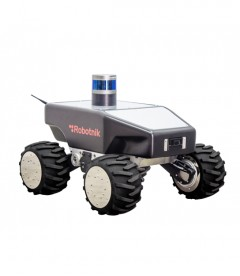
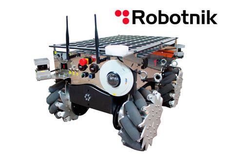
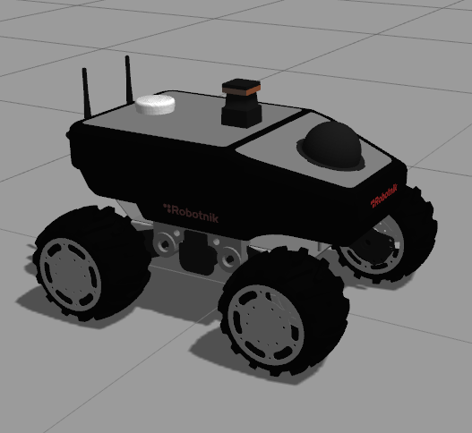
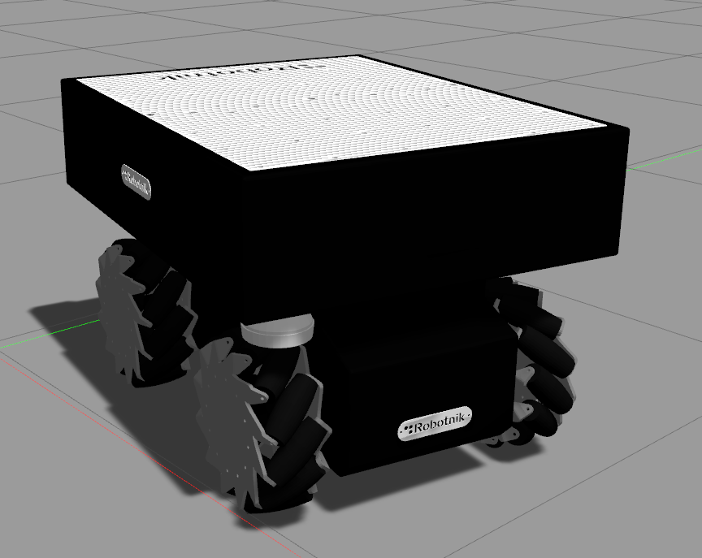

# summit_xl_common

Common packages of the Summit XL: URDF description of the Summit XL, Summi XL Steel and Summit XL HL, platform messages and other files for simulation.

  
  
  
  

## Packages

### summit_xl_control

This package contains the launch and configuration files to spawn the joint controllers with the ROS controller_manager. It allows to launch the joint controllers for the:
- Summit XL (4 axes skid steering + 2 axes ptz)
- Summit XL OMNI (4 axes skid steering, 4 axes swerve drive)
- Summit X-WAM (4 axes skid steering, 4 axes swerve drive, 1 linear axis for scissor mechanism).

The Summit XL simulation stack follows the gazebo_ros controller manager scheme described in
[http://gazebosim.org/tutorials](http://gazebosim.org/tutorials)

### summit_xl_description

The urdf, meshes, and other elements needed in the description are contained here. The standard camera configurations have been included (w/wo sphere_camera, w/wo axis_camera, etc.). This package includes the description of the Summit XL, Summit XL STEEL (and HL versions) mobile platforms.
The package includes also some launch files to publish the robot state and to test the urdf files in rviz.

### summit_xl_localization

This package contains launch files to use the EKF of the robot_localization package with the Summit XL robots. It contains a node to subscribe to gps data and publish it as odometry to be used as an additional source for odometry.

### summit_xl_navigation

This package contains all the configuration files needed to execute the AMCL and SLAM navigation algorithms in simulation.

### summit_xl_pad

This package contains the node that subscribes to /joy messages and publishes command messages for the robot platform including speed level control. The joystick output is feed to a mux [http://wiki.ros.org/twist_mux](http://wiki.ros.org/twist_mux) so that the final command to the robot can be set by different components (move_base, etc.)

The node allows to load different types of joysticks (PS4, PS3, Logitech, Thrustmaster). New models can be easily added by creating new .yaml files. If modbus_io node is available, the digital outputs (ligths, axes, etc.) can also be controlled with the pad. If ptz camera is available, the pan-tilt-zoom can also be commanded with the pad. 
